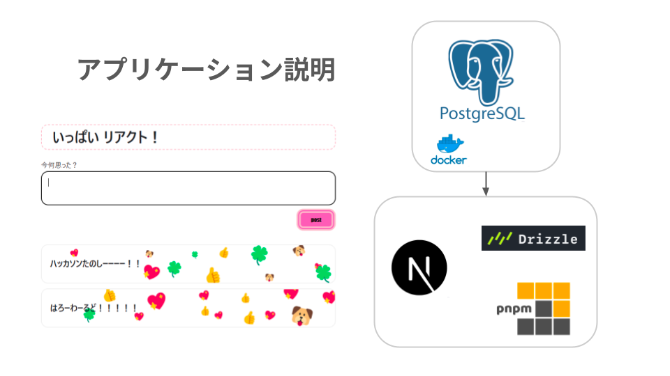
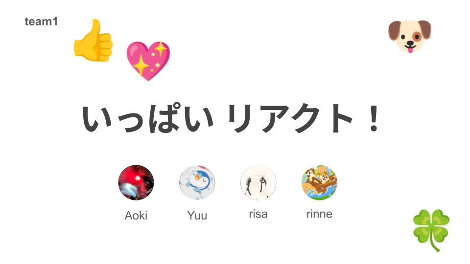

# いっぱい リアクト！

### Date

2024/05/12 ~ 05/13
 

## About

---

dohack-team1 のリポジトリです
テーマは「**コミュニケーション促進**」を選択しました
 

## 概要

---

👤「Discord 過疎ってませんか？」「コミュニケーション滞ってませんか？」

そこで、do’er のコミュニケーション促進を目的とした「**いっぱい　リアクト！**」という新 SNS を開発しました！📱

## 機能

---

### この SNS では

投稿へのリアクションの新たな仕組みを提案します 👍

### 具体的には・・

- 投稿するとリアクションが一目でわかる！？
  - リアクションをさまざまな絵文字で送れる！
  - 絵文字を投稿の上に貼り付けることで、楽しくリアクションができる！注目度もわかる ✨
    → いいねってどうしても数値で測ってしまいますよね 💬
    視覚的により人の印象に残る形でリアクションが見られるので、Discord 含め他の SNS と差別化できます！

## menber

---

<table>
 <tr>
 　<th>開発人数</th>
 　<td>
     4人 
    <b><a　chef="https://github.com/RyushiAok">@RyushiAok</a></b>
     <b><a chef="https://github.com/rinne17">@rinne17</a></b>><b><a chef="https://github.com/teradayu">@teradayu</a></b> <b><a chef="https://github.com/rlsqo">@rlsqo</a></b>
    </td>
  </tr>
</table>　

## slide

---

スライド URL https://docs.google.com/presentation/d/1uKRdniIHelG9sQN6LRhWRzKgiLxPwe-6k9AU5wQa0TE/edit?usp=sharing
 
